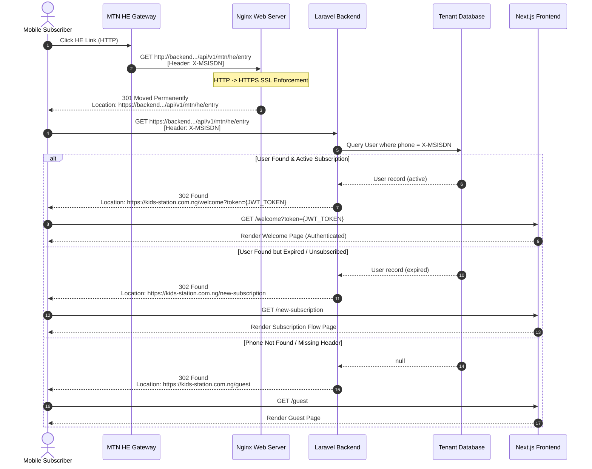

# MTN Header Enrichment (HE) Redirect Flow Documentation

This document explains the end-to-end request lifecycle and redirect flow for the MTN Header Enrichment (HE) endpoint at `/api/v1/mtn/he/entry`.

---

## 1. Overview & Architecture

When mobile subscribers on the MTN cellular network click a campaign link or visit the service entry point, the request passes through MTN's Header Enrichment gateway, Nginx reverse proxy, and Laravel backend before landing on the frontend application.

- **Entry URL (HTTP):** `http://backend.kids-station.com.ng/api/v1/mtn/he/entry`
- **Secure Endpoint (HTTPS):** `https://backend.kids-station.com.ng/api/v1/mtn/he/entry`
- **Header Injected by Carrier:** `X-MSISDN: <phone_number>`

---

## 2. Sequence Diagram



---

## 3. Step-by-Step Request Lifecycle

### Step 1: Carrier / User HTTP Request
The mobile network or third-party initiates an HTTP request to:
`http://backend.kids-station.com.ng/api/v1/mtn/he/entry`

### Step 2: Nginx SSL Redirection (`301 Moved Permanently`)
Nginx intercepts unencrypted HTTP traffic and returns:
- **HTTP Status:** `301 Moved Permanently`
- **Header:** `Location: https://backend.kids-station.com.ng/api/v1/mtn/he/entry`

> [!NOTE]
> Web browsers, mobile devices, and Postman (with redirects enabled) automatically follow this 301 redirect to HTTPS in milliseconds without user interaction.

### Step 3: Laravel Route Handling & Database Check
The request reaches Laravel's `heEntry` method in `LandingPage.php`:
1. Reads `X-MSISDN` (case-insensitive header).
2. Looks up the phone number in the tenant database (`users` table).
3. Logs the attempt into the `he_entries` database table.

### Step 4: Final Decision Matrix & 302 Redirect

| Condition | Database Status | Redirect Location | HTTP Status |
| :--- | :--- | :--- | :--- |
| `X-MSISDN` found & subscription active | `subscription_status = 1`<br/>`expiration_date > now()` | `https://kids-station.com.ng/welcome?token=<access_token>` | `302 Found` |
| `X-MSISDN` found but expired | `subscription_status = 0` OR<br/>`expiration_date <= now()` | `https://kids-station.com.ng/new-subscription` | `302 Found` |
| `X-MSISDN` not registered | User row missing | `https://kids-station.com.ng/guest` | `302 Found` |
| `X-MSISDN` missing / empty | Header omitted | `https://kids-station.com.ng/guest` | `302 Found` |

---

## 4. How to Test the Flow

### Option A: Using `curl` Command
To see the full redirect chain including headers:

```bash
# Follow both Nginx (301) and Laravel (302) redirects:
curl -i -L \
  -H "X-MSISDN: 2348012345678" \
  http://backend.kids-station.com.ng/api/v1/mtn/he/entry
```

### Option B: Testing in Postman
1. **URL:** `http://backend.kids-station.com.ng/api/v1/mtn/he/entry`
2. **Headers:** Set `X-MSISDN` = `2348012345678`
3. **To see full flow to frontend:** Keep **Automatically follow redirects** enabled under `Settings`.
4. **To inspect 302 header:** Disable **Automatically follow redirects**, change URL to `https://...`, and click **Send**. Check the `Location` header under response headers.

### Option C: Testing in Desktop Browser (ModHeader Extension)
1. Install **ModHeader** extension in Chrome or Edge.
2. Add Request Header: `X-MSISDN` = `2348012345678`.
3. Open `http://backend.kids-station.com.ng/api/v1/mtn/he/entry` in the browser URL bar.

---

## 5. Helper Script: Creating Test Users in Database

To test the `/welcome?token=` redirect, create a test user via Artisan Tinker:

```bash
php artisan tinker
```

```php
use App\Models\Tenant;
use App\Models\User;

// Select tenant context
$tenant = Tenant::where('name', 'naijria')->first() ?? Tenant::first();
$tenant->makeCurrent();

// Create active subscribed user
User::updateOrCreate(
    ['phone' => '2348012345678'],
    [
        'subscription_status' => 1,
        'expiration_date' => now()->addDays(30),
        'action' => 'SUBSCRIBED_NEW',
    ]
);
```
